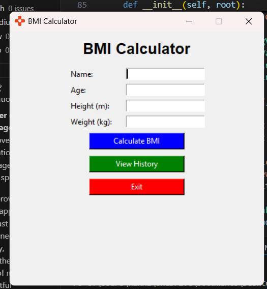
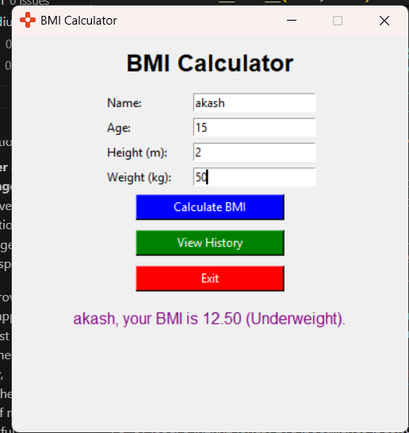
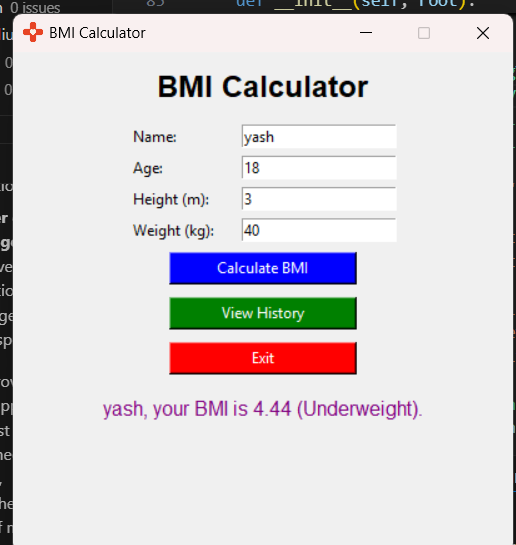
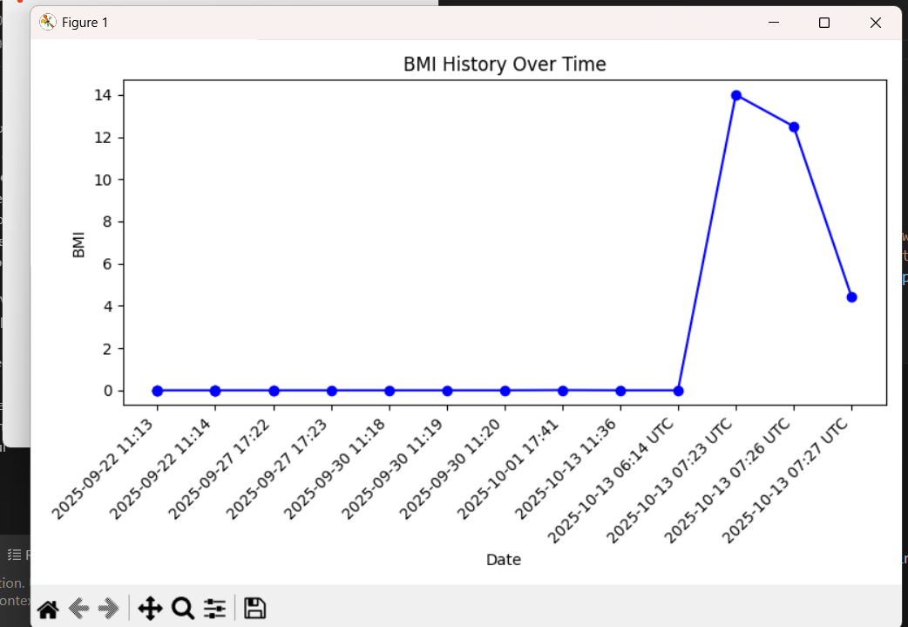
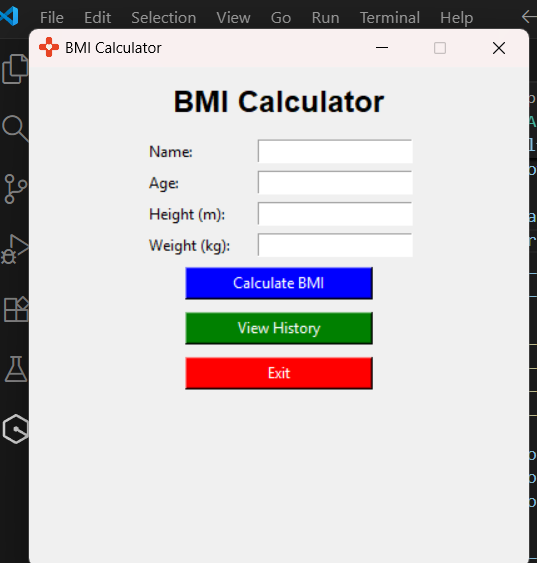
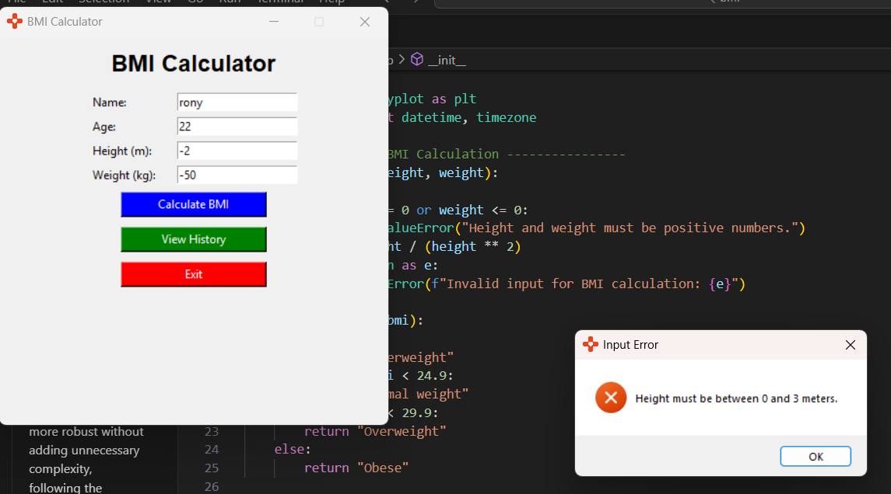

## Body Mass Index (BMI) Calculator
This is a simple Body Mass Index (BMI) calculator implemented in Python. The BMI is a measure of body fat based on height and weight that applies to adult men and women .

### Features
- Calculate BMI based on user input for weight (in kilograms) and height (in meters).
- Provide BMI category based on the calculated BMI value.
### Usage
1. Clone the repository or download the script.
2. Run the script using Python 3.x.
3. Input your weight in kilograms and height in meters when prompted.
4. The script will output your BMI value and the corresponding BMI category.
### Example
```
Enter your weight in kilograms: 70  
Enter your height in meters: 1.75
Your BMI is: 22.86
You are in the Normal weight category.
```
### BMI Categories
- Underweight: BMI < 18.5
- Normal weight: 18.5 ≤ BMI < 24.9
- Overweight: 25 ≤ BMI < 29.9
- Obesity: BMI ≥ 30
### Requirements
- Python 3.13.Tkinter .
### License
This project is licensed under the MIT License.


### Screenshots 















